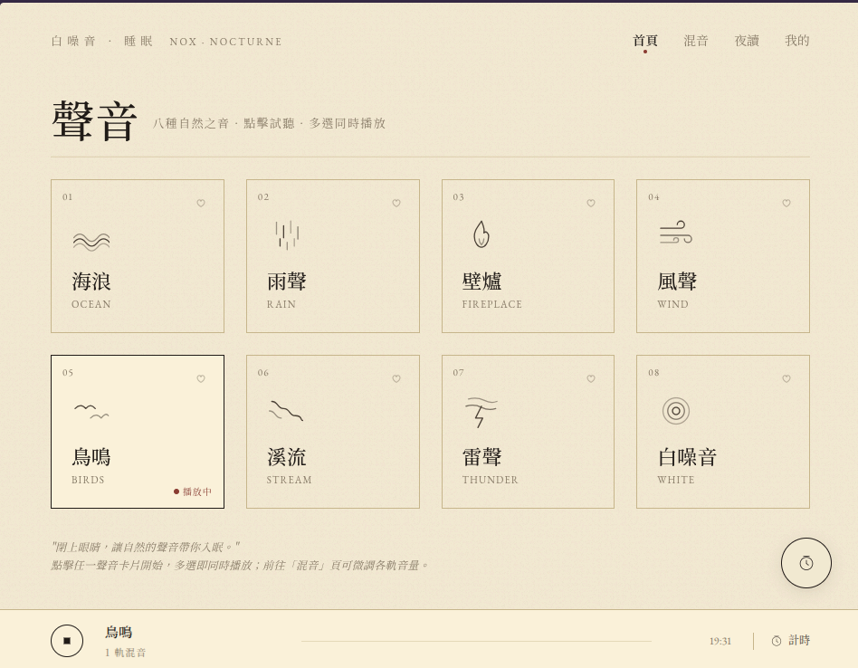
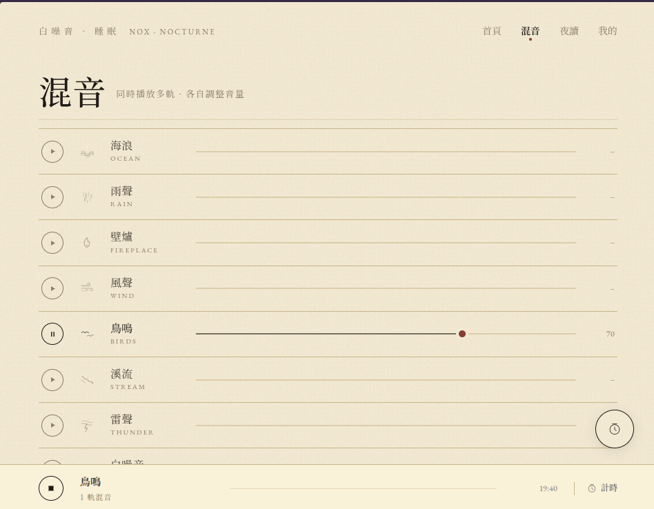
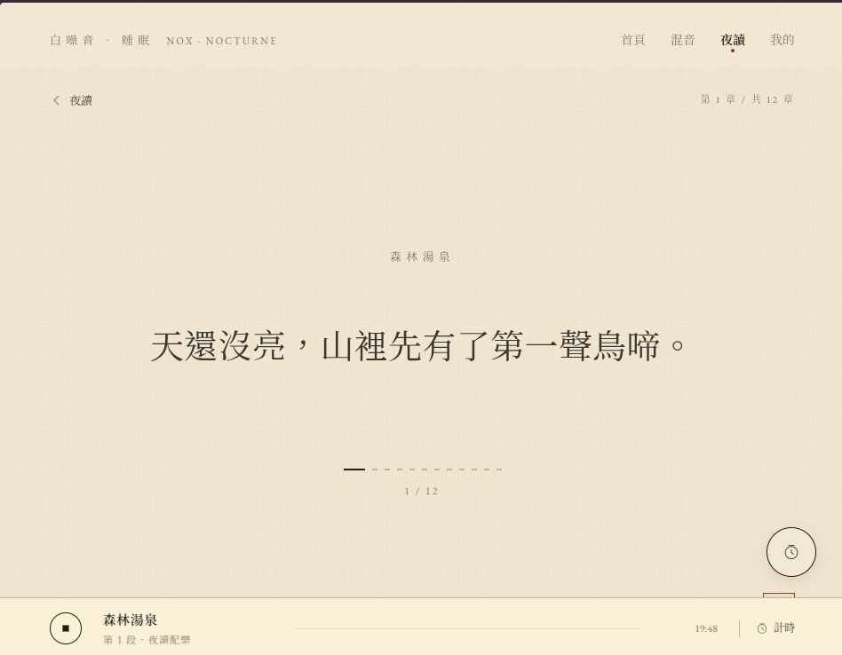

# 白噪音與睡眠

[](https://svelte.dev/)
[](https://vitejs.dev/)
[](https://www.typescriptlang.org/)
[](https://tonejs.github.io/)
[](https://nodejs.org/)

**[🎧 線上試聽](https://blue-rubiks.github.io/moonseal/)**

一款純前端的 PWA 白噪音／助眠 App。八種自然聲響、多軌混音、有旁白文字的夜讀模式、睡眠計時器，所有自訂內容皆儲存在瀏覽器 IndexedDB，無後端、無帳號。

## 功能特色

- **八種內建聲音**：海浪、雨聲、壁爐、風聲、鳥鳴、溪流、雷聲，以及合成的白噪音
- **多軌混音**：可同時播放多種聲音並各自調整音量，打造專屬背景
- **夜讀模式**：五則內建夜讀（海邊漫步、雨夜壁爐、森林湯泉、山中溪流、夏夜雷雨），每篇約 25–30 分鐘，分為 12 段、段間 crossfade，並有單句旁白文字
- **自訂夜讀**：自己編排聲音段落、淡入淡出與文字，存於本機 IndexedDB
- **睡眠計時器**：到時自動淡出停止，不會突兀打斷
- **PWA 離線可用**：安裝後音訊由 Service Worker 快取，離線也能播
- **純前端**：沒有後端、沒有登入、沒有追蹤

## Demo / 螢幕截圖

| 聲音 | 混音 |
| :---: | :---: |
|  |  |
| **夜讀** | **收藏** |
|  |  |

## 技術棧

- [Svelte 5](https://svelte.dev/) — UI 框架（Runes 模式）
- [Vite 8](https://vitejs.dev/) — 開發與打包
- [Tone.js](https://tonejs.github.io/) — Web Audio 混音、淡入淡出、合成器
- [idb](https://github.com/jakearchibald/idb) — IndexedDB 包裝（本地儲存自訂故事、我的最愛、混音預設、最近播放與設定）
- [vite-plugin-pwa](https://vite-pwa-org.netlify.app/) — Service Worker 與 Web App Manifest
- [Vitest](https://vitest.dev/) — 單元測試

## 環境需求

- Node.js 24+（LTS）
- pnpm 10+
- Docker（正式環境部署用）

## 開發

```bash
pnpm install
pnpm dev          # http://localhost:5173
pnpm test         # vitest watch 模式
pnpm test:run     # vitest 單次執行
pnpm check        # svelte-check + tsc
pnpm build        # 打包到 dist/
pnpm preview      # 在 :4173 預覽 production build
```

## 部署（Docker）

```bash
docker compose up -d --build
# App 會跑在 http://localhost:8080
```

正式環境若需 HTTPS，請在 8080 前面架一層反向代理。PWA service worker 需要 HTTPS 才能運作（localhost 例外）。

## 部署（GitHub Pages / GitHub Actions）

專案內建 `.github/workflows/deploy.yml`，推到 `main` 時會自動執行測試、打包並部署到 GitHub Pages：

1. 在 repo 的 **Settings → Pages** 將 Source 設為 **GitHub Actions**
2. push 到 `main` 即會觸發部署，也可在 Actions 頁面手動 `workflow_dispatch`
3. 部署完成後，網址會出現在 workflow 的 `Deploy to GitHub Pages` 步驟輸出中

GitHub Pages 預設提供 HTTPS，PWA service worker 可直接運作。

## 專案結構

詳見 [`docs/superpowers/specs/2026-05-09-whitenoise-design.md`](docs/superpowers/specs/2026-05-09-whitenoise-design.md)。

## 開發方法

本專案使用 [obra/superpowers](https://github.com/obra/superpowers) 提供的 Claude Code skills 開發。設計規格與實作計畫保留在 [`docs/superpowers/`](docs/superpowers/)：

- [`specs/2026-05-09-whitenoise-design.md`](docs/superpowers/specs/2026-05-09-whitenoise-design.md) — 設計規格
- [`plans/2026-05-09-whitenoise-app.md`](docs/superpowers/plans/2026-05-09-whitenoise-app.md) — 實作計畫

## 授權與音訊素材

`public/audio/` 內 7 個循環音效皆為 CC0 / Public Domain 授權，來源、授權與 ffmpeg 處理流程詳見 [`public/audio/README.md`](public/audio/README.md)。

白噪音不在此資料夾，由 Tone.js `Noise('white')` 即時合成。
